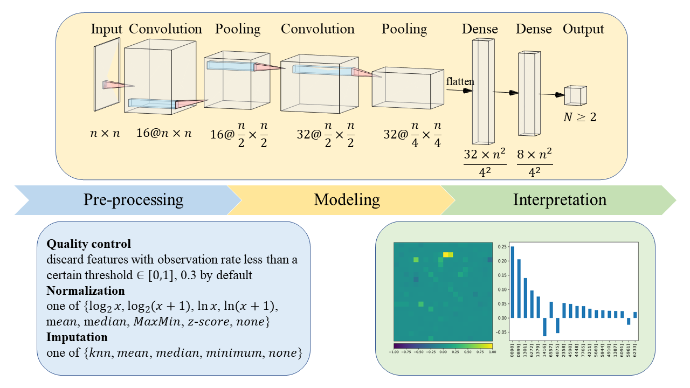

**MIIDL** `/ˈmaɪdəl/` is a Python package for microbial biomarkers identification powered by interpretable deep learning.



---
## Getting Started

👋Welcome! 

[🔗This guide](https://github.com/chunribu/miidl/blob/main/Tutorials.ipynb) will provide you with a specific example that using `miidl` to detect microbial biomarkers of colorectal cancer and predict clinical outcomes. 

After that, you will learn how to use this tool properly.

---
## Installation

```bash
pip install miidl
```
or
```bash
conda install miidl captum -c pytorch -c conda-forge -c bioconda
```

---
## Features

+ One-stop profiling
+ Multiple strategies for biological data
+ More interpretable, not a "black box"

---
## Workflow

#### 1) Quality Control

The very first procedure is filtering features according to a threshold of observation (non-missing) rate (0.3 by default).

#### 2) Normalization

`miidl` offers plenty of normalization methods to transform data and make samples more comparable. 

#### 3) Imputation

By default, this step is unactivated, as `miidl` is designed to solve problems including sparseness. But imputation can be useful in some cases. Commonly used methods are available if needed. 

#### 4) Reshape

The pre-processed data also need to be zero-completed to a certain length, so that a CNN model can be applied.

#### 5) Modeling

A CNN classifier is trained for discrimination. [PyTorch](https://pytorch.org) is needed.

#### 6) Interpretation

[Captum](https://captum.ai/) is dedicated to model interpretability for PyTorch. This step relies heavily on captum.

---
### Contact

If you have further thoughts or queries, please feel free to email at [chunribu@mail.sdu.edu.cn](mailto:chunribu@mail.sdu.edu.cn) or open an issue!

---
### Citation

```
@misc{jiang2021miidl,
      title={MIIDL: a Python package for microbial biomarkers identification powered by interpretable deep learning}, 
      author={Jian Jiang},
      year={2021},
      eprint={2109.12204},
      archivePrefix={arXiv},
      primaryClass={q-bio.QM}
}
```

---
### License

MIIDL is released under the [MIT license](https://github.com/chunribu/miidl/blob/main/LICENSE).


<script>
    document.head.innerHTML+='<link rel="shortcut icon" type="image/x-icon" href="favicon.ico">'
</script>
